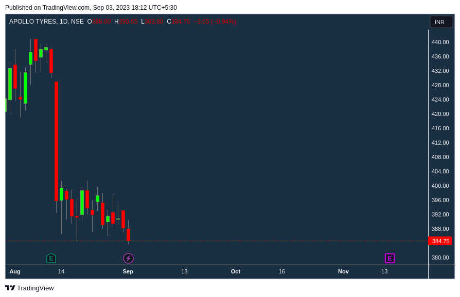
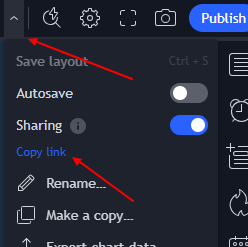

# tradingview-screenshot
Capturing any Public Chart available in Tradingview

## About Unofficed Community

This tool has been developed to cater to the needs of the [Unofficed](https://www.unofficed.com/)  community. Unofficed is a vibrant community of traders, developers, and enthusiasts passionate about financial markets and trading strategies.

Visit the [Unofficed Community Chat](https://www.unofficed.com/chat/) to engage in discussions, share insights, and collaborate with fellow members. Join the community to explore a wealth of knowledge and resources related to trading and financial markets.

# TradingView Screenshot Capture



## Overview

This Python script automates the process of capturing screenshots from TradingView charts and converting TradingView chart links into direct image URLs for sharing. It's a useful tool for traders and analysts who want to streamline the process of capturing and sharing TradingView chart images.

#Setup 

## Get your Tradingview Public Link

- Access your chart settings on TradingView.
- Change the sharing settings for your chart to "Public."
- Copy the chart's public link.
- Paste the copied chart link inside the tview_ss.py.py script.



## Prerequisites

Before using this script, ensure you have the following prerequisites installed:

- Python (3.x recommended)
- Selenium library
- Chrome WebDriver
- xclip (for Linux systems)

You can install Python packages using `pip`:

```bash
pip install selenium
```

To download Chrome WebDriver, visit ChromeDriver Downloads.

To install xclip, you can use the package manager specific to your Linux distribution.
Ubuntu/Debian:
```bash
sudo apt-get update
sudo apt-get install xclip
```

Usage
Clone this repository to your local machine:
```bash
git clone https://github.com/your-username/tradingview-screenshot-capture.git
```
Navigate to the project directory:
```bash
cd tradingview-screenshot-capture
```
Run the script, providing the desired TradingView symbol as an argument (default is "NONE"):
```bash
python capture_tradingview_screenshot.py
```
Wait for the script to execute. It will capture the TradingView chart screenshot and provide you with a direct image URL.

You can also check the locally saved screenshot as "m7azfyek.png" in the main directory.

Example Output
```ruby
Chart is ready for capture
https://www.tradingview.com/x/m7azfyek/
Chart Link: https://s3.tradingview.com/snapshots/m/m7azfyek.png
```
License
This project is licensed under the MIT License. See the LICENSE file for details.

Acknowledgments
This script uses Selenium to automate web interactions with TradingView.
Special thanks to the TradingView platform for providing valuable financial charting tools.

## Tkinter Version of Clipboard

There is another version of the program which is saved as `tview_tkinter.py`. It uses `tkinter` instead of `xclip`. 

Unfortunately, both of the methods do not work using the Chrome headless version. 
